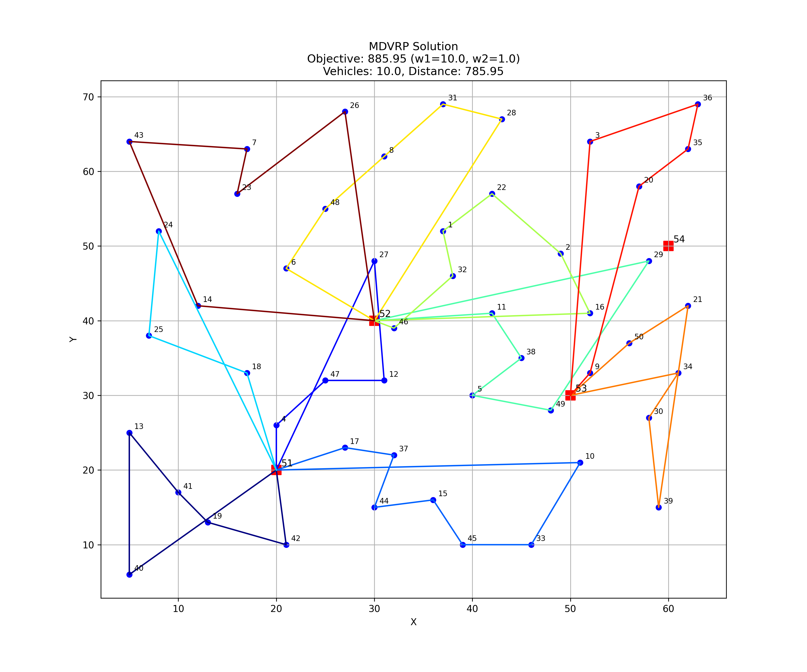
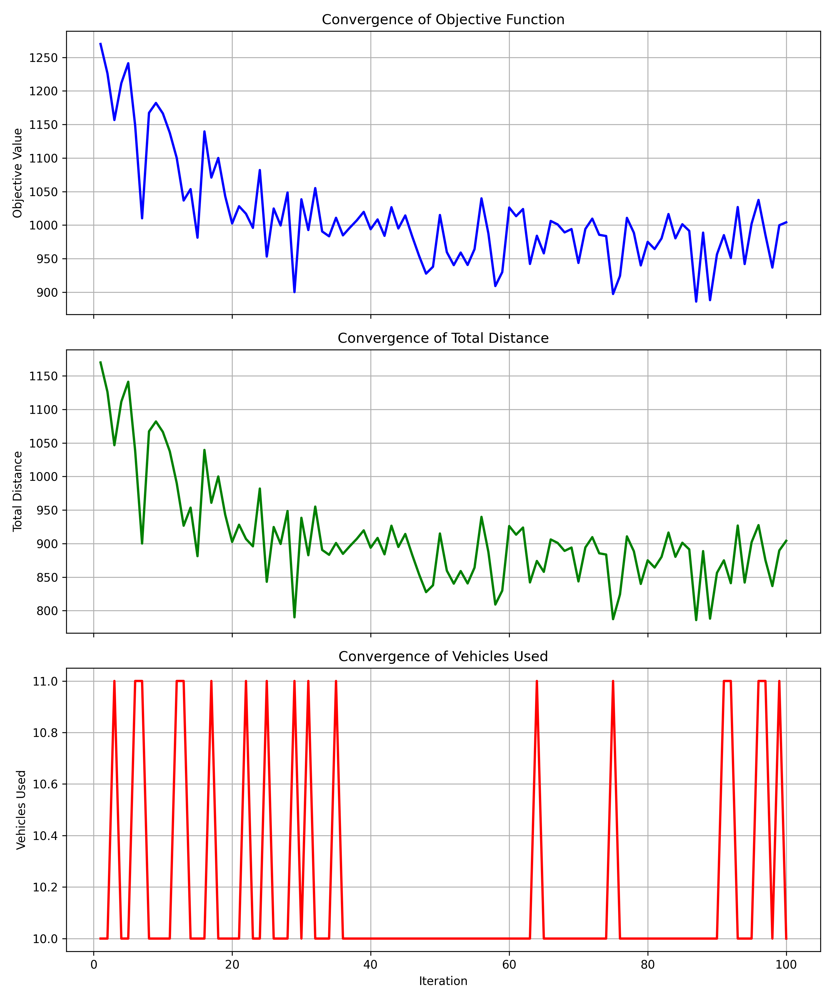

# Multi-Depot Vehicle Routing Problem Solver using Ant Colony Optimization

This repository contains an implementation of an Ant Colony Optimization (ACO) algorithm for solving the Multi-Depot Vehicle Routing Problem (MDVRP). The algorithm combines heuristic information with pheromone-based learning to efficiently assign customers to depots and construct vehicle routes.



## Solution Structure

In the MDVRP-ACO algorithm, a solution is represented as a nested list structure:

```
solution = [
    [depot_node, customer1, customer5, customer3, depot_node],
    [depot_node, customer2, customer4, depot_node],
    [depot_node2, customer7, customer6, depot_node2],
    # more routes...
]
```

Where:
- Each inner list represents one complete vehicle route
- Each route starts and ends at the same depot
- The nodes between are customers visited in sequence
- All entries are indices corresponding to positions in the coordinate arrays

## Problem Description

The Multi-Depot Vehicle Routing Problem (MDVRP) extends the classic Vehicle Routing Problem by introducing multiple depot locations. The goal is to:

1. Assign customers to depots
2. Determine routes for vehicles based at each depot
3. Minimize both the total travel distance and the number of vehicles used
4. Respect vehicle capacity constraints

## Algorithm Features

- **Bi-objective optimization**: Balances minimizing both distance and vehicle count
- **Adaptive customer-depot assignment**: Uses pheromone trails to learn good assignments
- **Probabilistic route construction**: Based on pheromone intensity and distance-based heuristics
- **Pheromone evaporation and deposit**: Reinforces good solutions while allowing exploration
- **Solution visualization**: Color-coded routes and depot assignments
- **Convergence tracking**: Monitors objective value, distance, and vehicle count over iterations

## Performance

The algorithm demonstrates effective convergence across multiple metrics:



The convergence graph shows:
- Decreasing objective function value over iterations
- Reduction in total distance traveled
- Optimization of vehicle usage

## Usage

```python
# Create and run the algorithm
aco = MDVRP_ACO(
    data_file="test_data/file_here",
    num_ants=20,
    pheromone_weight=1.0,      # Alpha: importance of pheromone trails
    heuristic_weight=2.0,      # Beta: importance of heuristic information
    evaporation_rate=0.1,      # Rho: pheromone evaporation rate
    pheromone_deposit=100,     # Q: pheromone deposit factor
    max_iterations=100,
    vehicle_cost_weight=10.0,  # Weight for number of vehicles
    distance_cost_weight=1.0   # Weight for total distance
)

# Run the algorithm
solution, obj_value, distance, vehicles = aco.run()

# Visualize the solution
aco.visualize_solution(solution)
```

## Parameters

- `num_ants`: Number of ants in the colony
- `pheromone_weight`: Importance of pheromone trails (alpha)
- `heuristic_weight`: Importance of heuristic information (beta)
- `evaporation_rate`: Rate at which pheromone evaporates (rho)
- `pheromone_deposit`: Amount of pheromone deposited by ants (Q)
- `max_iterations`: Maximum number of algorithm iterations
- `vehicle_cost_weight`: Weight coefficient for vehicle count in objective function
- `distance_cost_weight`: Weight coefficient for distance in objective function

## Input Format

The solver accepts standard MDVRP benchmark files with the following format:
1. First line: problem type, vehicles per depot, number of customers, number of depots
2. Next lines: depot capacity information
3. Customer data: ID, coordinates, service time, demand
4. Depot data: ID, coordinates

## Requirements

- NumPy: For matrix operations and numerical calculations
- Matplotlib: For solution visualization
- Random: For probabilistic selections during solution construction

## How It Works

The ACO algorithm mimics the foraging behavior of ants:

1. **Initialization**: Set up pheromone trails and heuristic information
2. **Solution Construction**: Each ant builds a complete solution by:
   - Assigning customers to depots
   - Constructing routes with capacity constraints
3. **Solution Evaluation**: Calculate objective value based on distance and vehicle count
4. **Pheromone Update**: Evaporate old pheromones and deposit new ones based on solution quality
5. **Iteration**: Repeat steps 2-4 for a fixed number of iterations
6. **Result**: Return the best solution found